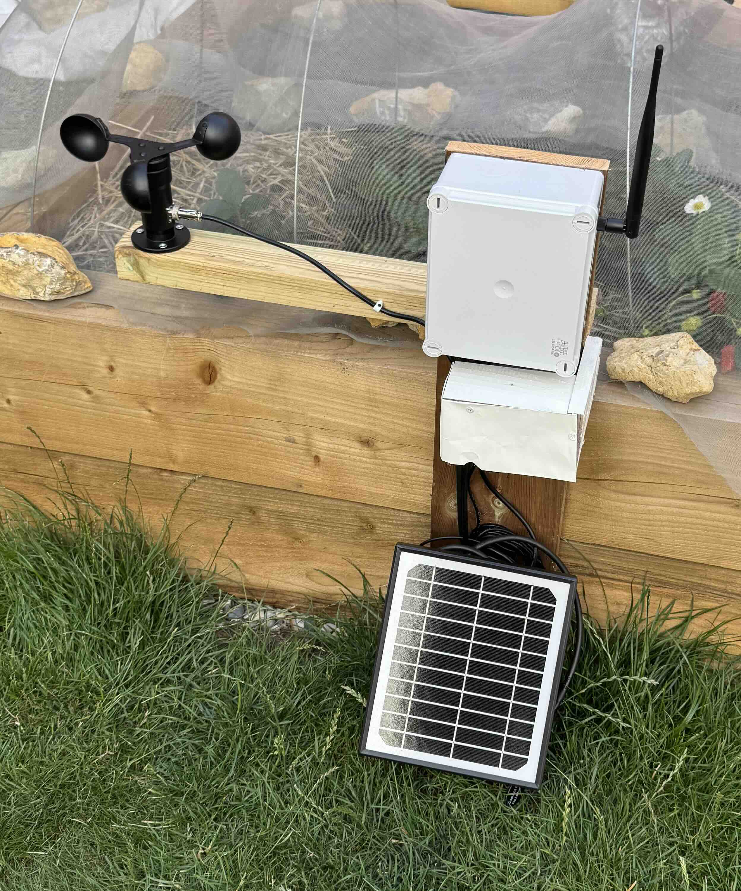
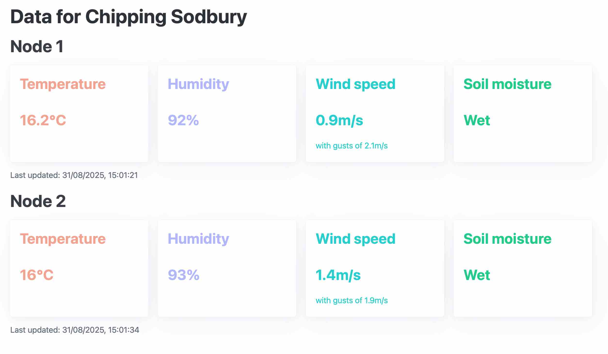
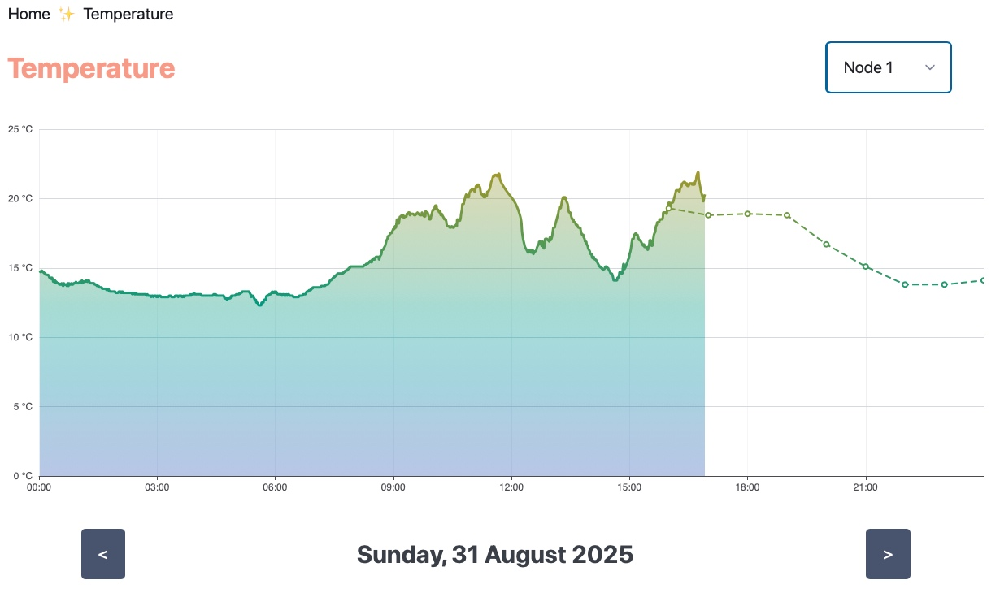
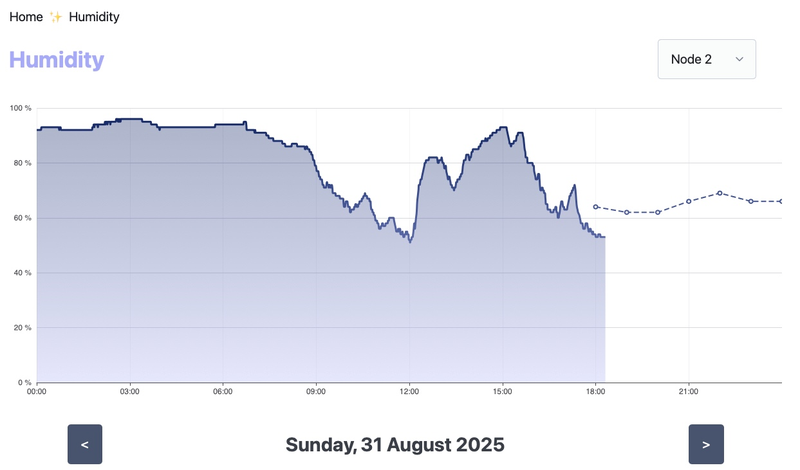
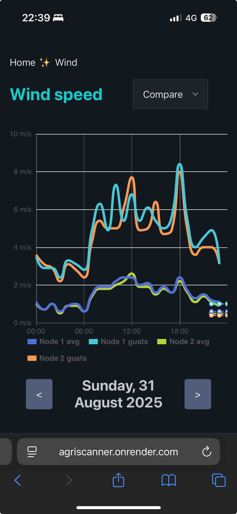
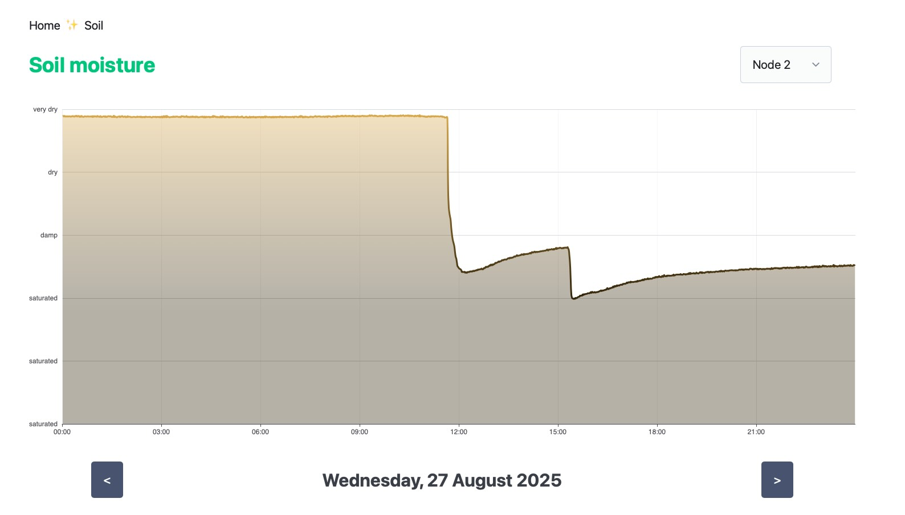
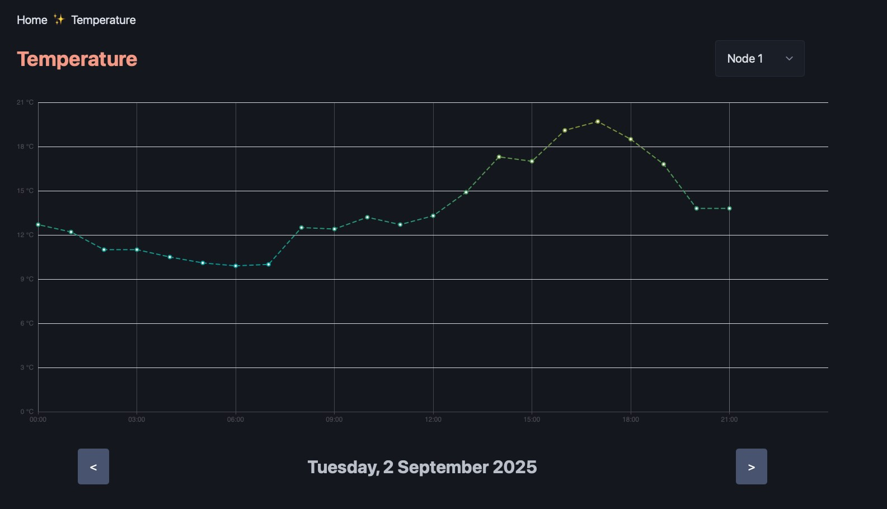

# microclimate-sensor-network

[Link to website](https://agriscanner.onrender.com/)

This repo holds the source documents for a prototype tool that helps farmers
monitor microclimates across their field in real time. This consists of a
backend TypeScript API that is linked to a PostgreSQL database and a frontend website
accessible via the link above. If you are interested in this project a complete write up was produced for my Master's dissertation and is [available here](https://github.com/adam-sid/UoB-dissertation/tree/main).

## Hardware

The hardware consists of four elements: two weather stations (as above), a repeater to boost range and a gateway to POST weather data to the API. These were built using iLabs Challenger RP2040 microcontrollers with a variety of sensors and packed into a water proof enclosure. They are completely off-grid with a solar-battery system and have a tested range of 2400m (much longer distances are expected to be possible)

## Features

### Dashboard

The main page shows the live weather data from the stations.

### Weather charts

Clicking on the data boxes on the dashboard will open an interactive chart for that sensor type:

Charts were made with the Apache Echarts library.

Displayed data can be toggled between node 1, node 2 and a compare function

The website is mobile friendly even on busier graphs and supports automatic light and dark mode.

### Forecasting

The backend also contains machine learning models that were generated from [this separate project](https://github.com/adam-sid/python-machine-learning). Data from OpenWeather API 3.0 is pulled across and run through the models to generate an accurate microclimate forecast up to 48 hours ahead.

